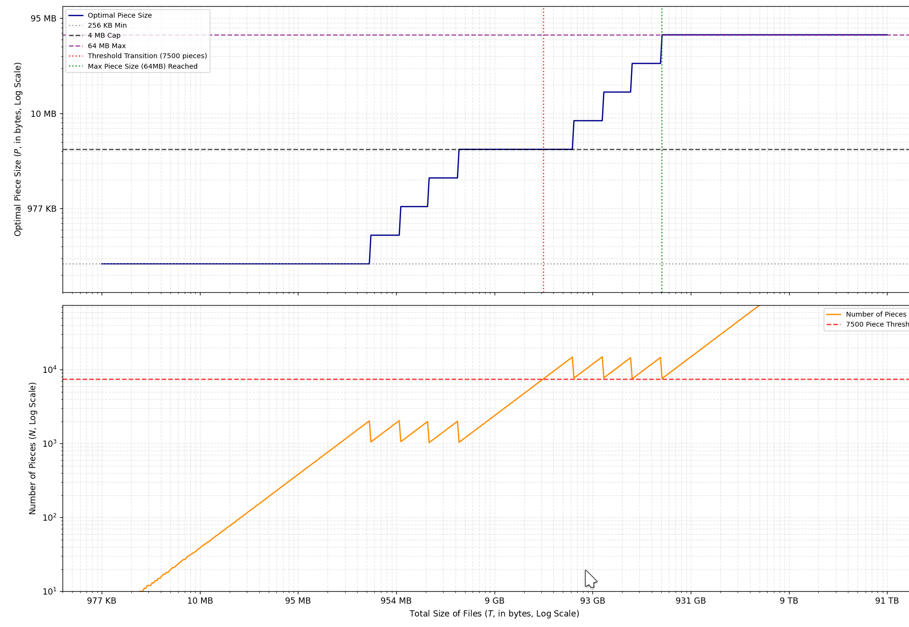

# mkmetalink

Generates valid Metalink v4 XML and BitTorrent v1 files given a file or directory and one or more web mirror locations

## Install

```sh
go install github.com/chapmanjacobd/mkmetalink@latest
```

## Example

```sh
$ mkmetalink -m https://example.com/ -m https://example.com/second_mirror/ ./dumps.wikimedia.org/relevance.zip
Total size: 222.9 MiB, piece size: 256.0 KiB, 1 files
  [1/1] relevance.zip

Generated:
./dumps.wikimedia.org/relevance.zip.meta4
./dumps.wikimedia.org/relevance.zip.torrent
```

## Folders / Relative paths

```sh
$ mkmetalink -m https://example.com/live/ ./2026-01-01/
```

Will create a metalink file that references multiple files. eg:

```xml
  <file name="2026-01-01/docs.txt">
    <url priority="1">https://example.com/live/2026-01-01/docs.txt</url>
    ...
  <file name="2026-01-01/v1/data">
    <url priority="1">https://example.com/live/2026-01-01/v1/data</url>
    ...
```

## Help

```sh
Usage: mkmetalink <path> [<mirrors> ...] [flags]

Arguments:
  <path>    File or directory to package

Flags:
  -h, --help                                                   Show context-sensitive help.
      --sign=STRING                                            If set, pass this GPG --local-user (key id) to sign
      --tracker="https://privtracker.com/metalink/announce"    Tracker URL for generated torrent's announce (default privtracker)
  -o, --out-dir=STRING                                         Optional output directory for generated files. Default: input file's parent directory or input directory
  -m, --mirrors=MIRRORS,...                                    HTTPS mirrors (if directory: base URLs)
```

## See Also

- [RFC 5854 - The Metalink Download Description Format](https://tools.ietf.org/html/rfc5854)
- [BEP 19 - WebSeed - HTTP/FTP Seeding](http://www.bittorrent.org/beps/bep_0019.html)
- [aria2 - Command-line download utility with Metalink support](https://aria2.github.io/)


